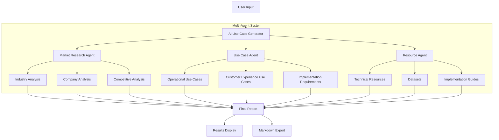

# AI Use Case Generator - Implementation Report

## 1. Project Overview
The AI Use Case Generator is a multi-agent system designed to analyze companies and industries, generate AI/ML use cases, and provide implementation resources. The system uses CrewAI framework with Gemini Pro LLM to create specialized agents that work together to deliver comprehensive analysis.

## 2. Architecture


## 3. Methodology

### 3.1 Agent Design
The system implements three specialized agents:

1. **Market Research Agent**
   - Role: Industry Research Specialist
   - Purpose: Analyze market trends and company position
   - Tools: Web search, Industry analysis

2. **Use Case Agent**
   - Role: AI Solutions Architect
   - Purpose: Generate practical AI/ML use cases
   - Focus: Operations and customer experience

3. **Resource Agent**
   - Role: Technology Resource Specialist
   - Purpose: Identify implementation resources
   - Tools: Dataset search, Technical documentation

### 3.2 Process Flow
```python
Process Flow:
1. User Input → Company/Industry Name
2. Market Research
   ↓
3. Use Case Generation
   ↓
4. Resource Collection
   ↓
5. Result Compilation
```

### 3.3 Implementation Details
```python
Technologies Used:
- CrewAI Framework
- Gemini Pro LLM
- Langchain
- Streamlit (UI)
- DuckDuckGo Search Tool
```

## 4. Key Components

### 4.1 Market Research Module
```python
research_task = Task(
    description=f"""Conduct market research:
    1. Industry Overview
    2. Company Position
    3. Competitive Landscape""",
    agent=research_agent
)
```

### 4.2 Use Case Generation
```python
use_case_task = Task(
    description=f"""Generate AI/ML use cases:
    1. Operational Enhancement
    2. Customer Experience
    3. Implementation Requirements""",
    agent=use_case_agent
)
```

### 4.3 Resource Collection
```python
resource_task = Task(
    description="""Identify resources:
    1. Technical Assets
    2. Data Resources
    3. Implementation Guides""",
    agent=resource_agent
)
```

## 5. Results Format

### 5.1 Output Structure
```markdown
# Analysis Report
## Market Research Summary
- Industry Overview
- Company Position
- Competitive Analysis

## AI/ML Use Cases
- Operational Use Cases
- Customer Experience Use Cases
- Implementation Requirements

## Implementation Resources
- Technical Resources
- Datasets
- Implementation Guides
```

## 6. Implementation Benefits

### 6.1 Technical Benefits
1. Modular Architecture
   - Easy to extend and modify
   - Independent agent functionality
   - Scalable design

2. Robust Processing
   - Sequential task execution
   - Error handling
   - Result validation

### 6.2 Business Benefits
1. Comprehensive Analysis
   - Market understanding
   - Practical use cases
   - Implementation guidance

2. Time Efficiency
   - Automated research
   - Structured output
   - Ready-to-use resources

## 7. Code Structure

```python
project_structure/
│
├── main.py              # Core implementation
├── app.py              # Streamlit interface
├── requirements.txt    # Dependencies
├── .env               # Configuration
└── results/           # Output storage
```

## 8. Sample Output

```markdown
# AI/ML Implementation Analysis for [Company]

## Market Research Summary
- Industry: [Details]
- Market Size: [Metrics]
- Competitors: [List]

## AI/ML Use Cases
1. Operational Enhancement
   - Use Case: [Description]
   - Benefits: [List]
   - Implementation: [Details]

2. Customer Experience
   - Use Case: [Description]
   - Benefits: [List]
   - Implementation: [Details]

## Implementation Resources
- Datasets: [Links]
- Tools: [Links]
- Guides: [Links]
```

## 9. Future Enhancements

1. Technical Improvements
   - Add more specialized agents
   - Implement parallel processing
   - Enhanced error handling

2. Feature Additions
   - Cost estimation
   - Implementation timeline
   - ROI calculator

3. UI Enhancements
   - Interactive visualizations
   - Custom report generation
   - Real-time updates

## 10. Conclusions

The AI Use Case Generator successfully:
1. Automates market research
2. Generates practical use cases
3. Provides implementation resources
4. Delivers structured outputs

The multi-agent architecture ensures:
1. Specialized task handling
2. Comprehensive analysis
3. Reliable results
4. Scalable implementation

## 11. Usage Instructions

1. Setup:
```bash
python -m venv .venv
source .venv/bin/activate
pip install -r requirements.txt
```

2. Configuration:
```bash
# Add to .env file
GOOGLE_API_KEY=your_gemini_api_key
```

3. Run:
```bash
streamlit run app.py
```

This report provides a comprehensive overview of the implementation, architecture, and functionality of the AI Use Case Generator. The system's modular design allows for easy extensions and modifications while maintaining robust performance and reliable outputs.
