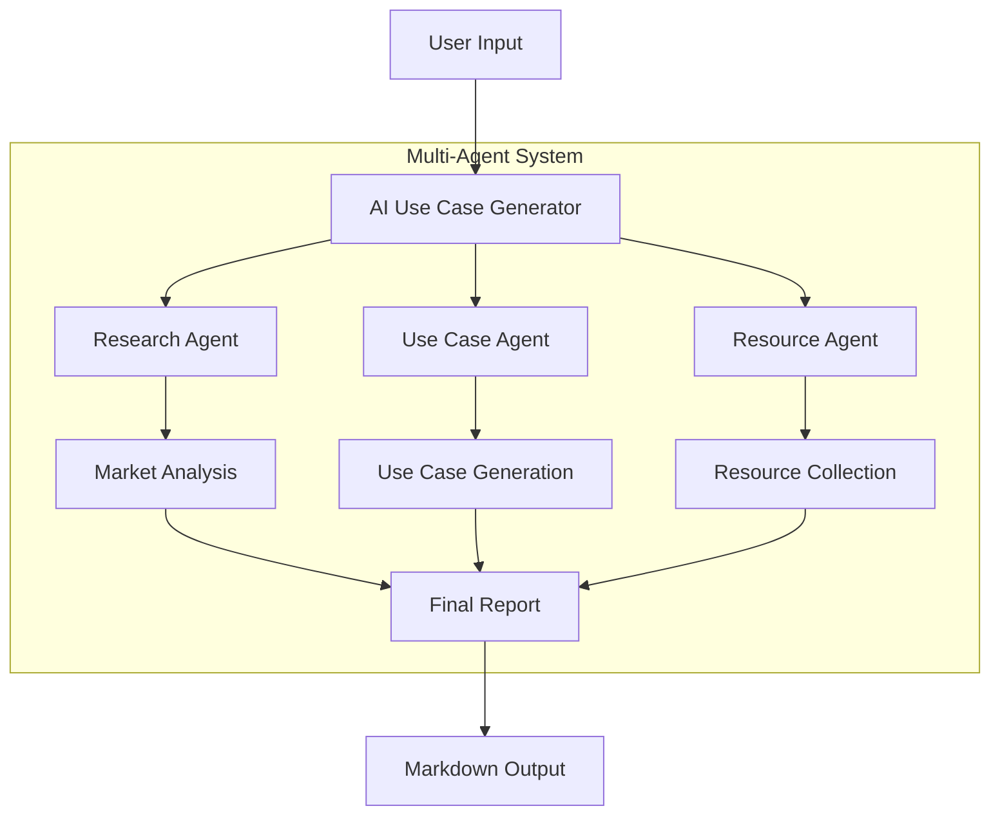

# AI Use Case Generator

## 1. Project Overview
The AI Use Case Generator is a specialized multi-agent system designed to provide comprehensive AI/ML implementation analysis for any industry or company. The system leverages CrewAI framework and Google's Gemini Pro LLM to generate actionable insights through three specialized agents.

## 2. System Architecture


## 3. Implementation Details

### 3.1 Core Components
```python
Key Components:
1. Research Agent
   - Role: Industry Researcher
   - Goal: Market analysis
   - Tools: Web search

2. Use Case Agent
   - Role: AI Solution Expert
   - Goal: Generate use cases
   - Tools: Web search

3. Resource Agent
   - Role: Resource Specialist
   - Goal: Find implementation resources
   - Tools: Web search
```

### 3.2 Technology Stack
```
- CrewAI: Agent orchestration
- Gemini Pro: LLM model
- Langchain: Tool integration
- Streamlit: User interface
- Python: Core implementation
```

## 4. Agent Tasks and Responsibilities

### 4.1 Research Agent Task
```python
research_task = Task(
    description=f"""Analyze the {company_name} industry and provide:
    ## Market Research Summary
    - Current market state and size
    - Key industry trends
    - Major players and competitors
    Keep it brief and informative.""",
    agent=research_agent
)
```

### 4.2 Use Case Agent Task
```python
use_case_task = Task(
    description=f"""Generate 2 practical AI use cases:
    ## AI/ML Use Cases
    1. First Use Case
       - Problem it solves
       - AI solution approach
       - Expected benefits
    2. Second Use Case
       - Problem it solves
       - AI solution approach
       - Expected benefits""",
    agent=use_case_agent
)
```

### 4.3 Resource Agent Task
```python
resource_task = Task(
    description=f"""Find specific resources:
    ## Implementation Resources
    1. Tools and Frameworks
    2. Datasets
    3. Implementation Guides""",
    agent=resource_agent
)
```

## 5. Sample Output Structure
```markdown
# AI/ML Implementation Analysis for [Company]

## Market Research Summary
- Industry overview
- Key trends
- Major players

## AI/ML Use Cases
1. First Use Case
   - Problem
   - Solution
   - Benefits

2. Second Use Case
   - Problem
   - Solution
   - Benefits

## Implementation Resources
1. Tools and Frameworks
2. Datasets
3. Implementation Guides
```

## 6. Error Handling and Fallbacks

### 6.1 Error Management
```python
try:
    result = crew.kickoff()
except Exception as e:
    return self.get_fallback_response(company_name)
```

### 6.2 Fallback Response
```python
def get_fallback_response(self, company_name: str) -> str:
    return f"""# AI/ML Implementation Analysis for {company_name}
    [Structured fallback content]"""
```

## 7. Key Features

### 7.1 Technical Features
- Multi-agent architecture
- Sequential processing
- Structured output format
- Error handling
- Result persistence

### 7.2 Business Features
- Industry analysis
- Practical use cases
- Implementation resources
- Actionable insights
- Downloadable reports

## 8. Usage Instructions

### 8.1 Setup
```bash
# Create virtual environment
python -m venv .venv
source .venv/bin/activate  # On Windows: .venv\Scripts\activate

# Install requirements
pip install -r requirements.txt
```

### 8.2 Configuration
```python
# .env file
GOOGLE_API_KEY=your_gemini_api_key_here
```

### 8.3 Running the Application
```bash
streamlit run app.py
```

## 9. Future Enhancements

### 9.1 Planned Improvements
1. Additional agent specializations
2. Enhanced error recovery
3. More detailed resource matching
4. Interactive result exploration
5. Custom report generation

### 9.2 Potential Extensions
1. Cost estimation module
2. Implementation timeline generator
3. ROI calculator
4. Industry benchmark comparisons

## 10. Conclusions

The AI Use Case Generator successfully:
1. Automates industry analysis
2. Generates practical AI use cases
3. Provides implementation resources
4. Delivers structured reports

Benefits:
- Time-efficient analysis
- Consistent output format
- Practical recommendations
- Resource-backed solutions

## 11. Dependencies
```txt
crewai==0.11.0
langchain>=0.1.0
langchain-google-genai==0.0.5
google-generativeai==0.3.2
streamlit==1.29.0
python-dotenv==1.0.0
duckduckgo-search==4.1.1
```

This report provides a comprehensive overview of the final implementation, highlighting the system's architecture, functionality, and potential for future enhancements. The multi-agent approach ensures thorough analysis and practical recommendations for AI implementation across different industries.
